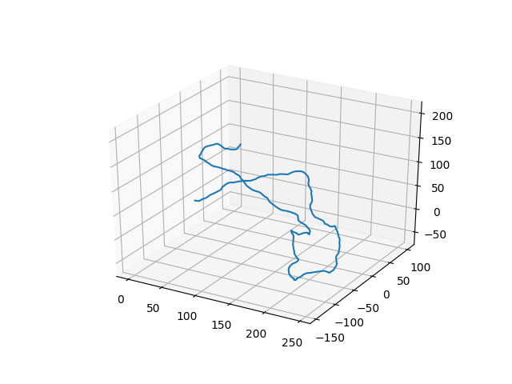

# PolymerCpp

3D wormlike chain generator for Python and written in C++.

PolymerCpp is a small program for generating three-dimensional
wormlike chains (WLC), a common and relatively simple model in polymer
physics. A WLC describes a semi-flexible polymer, i.e. one that is
rigid over short length scales and flexible over long ones. The
characteristic length scale that separates these two regimes is known
as the persistence length.

PolymerCpp provides a number of Python functions that exposes the C++
routines for generating 3D WLCs, including

1. infinitesimally thin WLCs
2. self-avoiding WLCs

PolymerCpp was written by [Marcel Stefko](https://github.com/MStefko)
and [Kyle M. Douglass](https://github.com/kmdouglass) in the
[Laboratory of Experimental Biophysics](http://leb.epfl.ch/) for
modeling DNA.

# Documentation

PolymerCpp documentation may be found at http://polymercpp.readthedocs.io/en/latest/

# License

PolymerCpp is licensed under the GNU General Public License,
version 3. See the [LICENSE](LICENSE) file for more information.

PolymerCpp uses the Eigen library, which is licensed under the Mozilla
Public License. For more information about Eigen, visit its website:
http://eigen.tuxfamily.org/index.php?title=Main_Page

